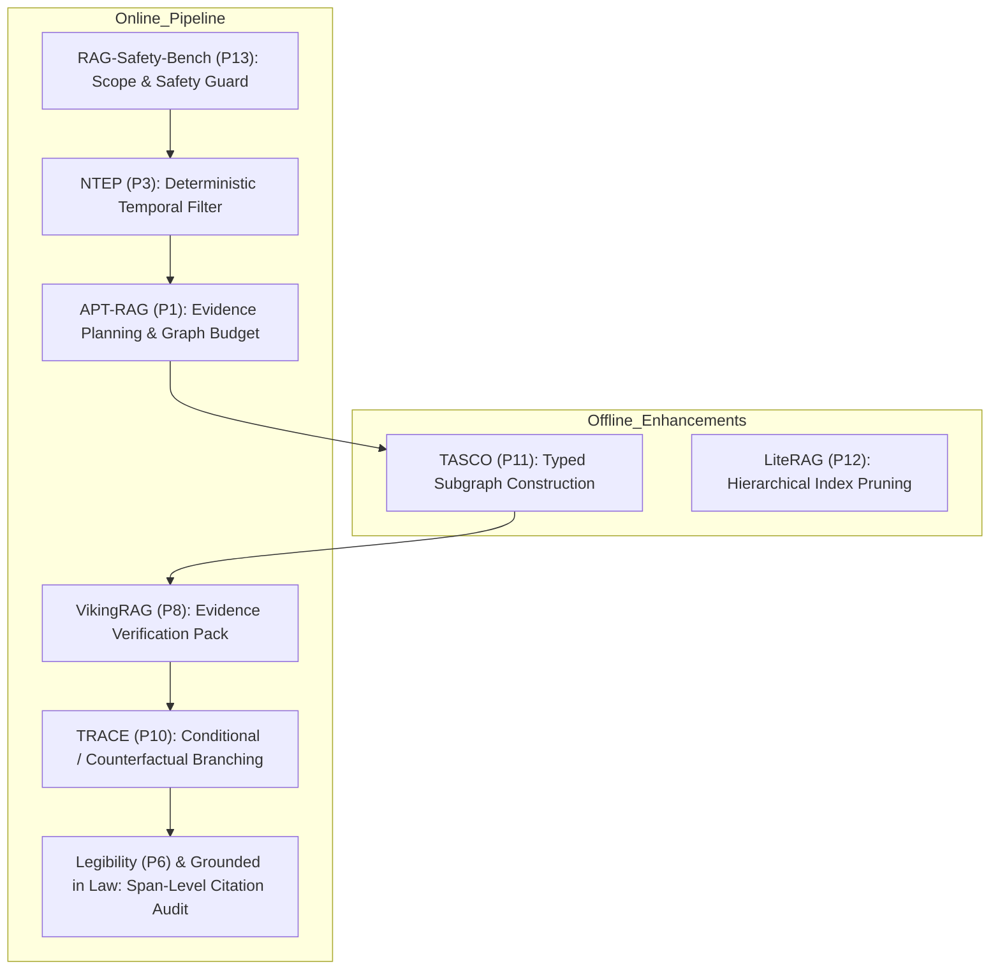

# RESEARCH PAPER INTEGRATION MATRIX

**Project:** Vietnamese Labor Legal GraphRAG / Pháp Điển AI  
**Scope:** Legal AI Reasoning, Graph Retrieval, Evidence Verification, Temporal Validity  
**Corpus / Domain:** Vietnamese Labor Law (Bộ luật Lao động 2012, 2019 & Guiding Instruments)  
**Date of Audit:** October 2026  

---

## 1. Executive Summary & Selection Principles

This matrix evaluates recent literature from `Research_Paper_Watch_31Aug-13Sep2026.pdf` alongside the project's foundational legal reasoning frameworks (LegalGraphRAG, FourCorners, ECoRAG, Grounded in Law).

### Evaluation & Adoption Criteria
Every candidate paper is evaluated against the core project hierarchy:
$$\text{CORRECTNESS} > \text{LEGAL TRACEABILITY} > \text{REPRODUCIBILITY} > \text{SAFETY} > \text{RETRIEVAL QUALITY} > \text{LATENCY} > \text{FEATURE COUNT}$$

Decisions fall into four distinct categories:
- **`ADOPT`**: High value, directly aligns with legal rigor, deterministic verification, or adaptive graph retrieval without architectural bloat. Concrete implementation roadmap defined.
- **`ALREADY_COVERED`**: Principles already instantiated in existing architecture (e.g., ECoRAG evidence loop, LegalGraphRAG 3-agent separation).
- **`EXPERIMENT`**: Valuable concept, but requires controlled ablation benchmark before full integration into production pipeline.
- **`REJECT`**: Incompatible with legal domain constraints (e.g., probabilistic approximations where legal exactness is required, multimodal UI navigation, or complex agent swarms that introduce non-deterministic hallucinations).

---

## 2. Comprehensive Paper Evaluation Matrix

| # | Paper / Framework | Core Mechanism | Fit with Vietnamese Labor Legal QA | Decision | Concrete Integration Plan / Rationale |
|---|---|---|---|---|---|
| **F1** | **LegalGraphRAG** (Chen et al., ACL 2026) | Multi-agent legal reasoning: HierarGraph, Fact/Rule/Ontology graphs, Researcher-Auditor-Adjudicator separation. | **Foundational**. Matches legal workflow: evidence gathering -> adversarial audit -> closed-world adjudication. | **`ADOPT` / `ALREADY_COVERED`** | Core pipeline already structured around Researcher, Evidence Auditor, and Closed-World Adjudicator. Enforce strict isolation: Adjudicator cannot see unverified documents. |
| **F2** | **FourCorners** (2026) | 4-facet legal document structure: Hierarchy (Chương-Mục-Điều-Khoản-Điểm), Temporal versions, Cross-references, Sequential order. | **Foundational**. Direct fit for Vietnamese statutory hierarchy and succession (BLLĐ 2012 vs BLLĐ 2019). | **`ADOPT` / `ALREADY_COVERED`** | Implemented in offline parser and Neo4j graph schema (`ProvisionVersion`, `PARENT_OF`, `NEXT_SIBLING`, `AMENDS`, `REPLACES`). |
| **F3** | **ECoRAG** | Evidence Coverage & gap analysis: iterative retrieval loop triggered only when evidence sufficiency score is below threshold. | **Foundational**. Eliminates both under-retrieval (missing guiding decrees) and over-retrieval (graph explosion). | **`ADOPT` / `ALREADY_COVERED`** | Implemented in Phase 7-8: `EvidenceGapDetector` checks whether governing provision requires guiding decree (e.g., Điều 35 khoản 2 requires Nghị định 145/2020/NĐ-CP). |
| **F4** | **Grounded in Law** | Post-generation deterministic reference audit: verification of all citations against statutory catalog and exact character spans. | **Critical Safety**. Zero tolerance for hallucinated legal provisions or fake case citations. | **`ADOPT`** | Phase 11 & 14: Deterministic regex and URI validator ensuring every Điều/Khoản/Điểm and official URL in final output is verified in `SourceCatalog`. |
| **P1** | **APT-RAG** | Adaptive retrieval with graph planning; dynamically plans query subgoals and traverses knowledge graph paths. | **High**. Complex labor queries require multi-step reasoning (e.g., unlawful termination -> severance allowance -> social insurance). | **`ADOPT`** | Use deterministic legal dependency planning (Fact Graph -> Statutory Provision -> Guiding Decree -> Limitation Period) rather than unconstrained LLM graph walking. Hard budget: max 3 hops. |
| **P2** | **DRACO** | Disentangled representation and alignment for complex organization/hierarchical retrieval. | **Moderate**. Disentangles structural hierarchy from semantic query intent. | **`EXPERIMENT`** | Useful for BGE-M3 dense retrieval: evaluate embedding Điều/Khoản with structural prefixes (`[Luật][Điều 35][Nghỉ việc riêng]`) vs raw text. |
| **P3** | **NTEP** | Non-stationary temporal event prediction; models evolving temporal states and validity transitions. | **High**. Labor law regimes transition strictly over time (BLLĐ 2012 expired 2020-12-31; BLLĐ 2019 effective 2021-01-01). | **`ADOPT`** | Implement deterministic temporal validity filter: given `event_date`, enforce `valid_from <= event_date <= valid_to`. Disallow predictive/probabilistic time scoring. |
| **P4** | **Terminal-Universe** | Benchmarking agentic workflows in real terminal environments. | **Low**. Project is a legal RAG engine and web API, not a general bash OS agent. | **`REJECT`** | Do not implement terminal execution tools in the legal QA agent runtime (safety risk and out of scope). |
| **P5** | **R²-MAD** | Robust & Reliable Multi-Agent Debate for resolving ambiguities in reasoning. | **Low / Risk**. Multi-agent debate in legal RAG often introduces circular hallucinations or increases latency $5\times$ without improving ground truth accuracy. | **`REJECT`** | Prefer deterministic Auditor verification over probabilistic multi-agent debate. Legal reasoning must adhere to statute hierarchy, not majority voting. |
| **P6** | **Legibility $\neq$ Interpretability** | Analyzes the disconnect between superficially clear explanations and actual mechanistic fidelity. | **High Relevance**. Legal users can be misled by convincing-sounding LLM explanations that lack legal grounding. | **`ADOPT`** | Strict UI & Output Requirement: Every claim must be tied to a highlighted character span and official URL. Forbid vague "theo quy định pháp luật" without exact Điều/Khoản. |
| **P7** | **Magenta** | Multimodal agent with goal-driven visual navigation. | **Out of Scope**. Vietnamese labor QA operates on legal text, statutory tables, and PDF scans (already converted offline to Markdown/JSON). | **`REJECT`** | Multimodal web navigation is irrelevant to core legal QA engine. OCR is handled offline via Docling. |
| **P8** | **VikingRAG** | Verification-guided knowledge integration: verifies retrieved knowledge chunks before integration into prompt. | **High**. Aligns with LegalGraphRAG Auditor role. Filters out obsolete or irrelevant provisions before generation. | **`ADOPT`** | `VerifiedEvidencePack` assembly: only provisions passing temporal audit, hierarchy check, and applicability filter are forwarded to the Adjudicator. |
| **P9** | **COBRA-Skills** | Compositional benchmark for real-world agent skills decomposition. | **Moderate**. Useful for benchmark design and test suite organization. | **`EXPERIMENT`** | Adapt benchmark taxonomy into Vietnamese Labor Legal Benchmark (single-provision lookup, temporal transition, multi-decree synthesis, negative query). |
| **P10** | **TRACE** | Temporal reasoning and counterfactual explanation for fact-checking. | **High**. Legal users frequently ask "What if": e.g., "Nếu tôi làm việc trong ngành đặc thù thì phải báo trước bao lâu?" | **`ADOPT`** | Counterfactual / conditional answering: when crucial facts are unspecified (e.g., `special_occupation = UNKNOWN`), provide conditional branch explanations instead of a single false assumption. |
| **P11** | **TASCO** | Task-adaptive subgraph construction for knowledge graph reasoning. | **High**. Prunes irrelevant legal graph branches to avoid context stuffing. | **`ADOPT`** | Construct task-adaptive subgraphs: expand ONLY along `GUIDED_BY` or `REFERS_TO` edges relevant to the identified `LegalIssue`, respecting edge type filters and maximum node budgets. |
| **P12** | **LiteRAG** | Lightweight and scalable RAG via efficient hierarchical indexing and pruning. | **High**. Keeps latency and memory low during local deployment (Ollama / small GPU / CPU). | **`ADOPT`** | Prune redundant parent chapters if child provision is already fully matched; cache frozen BM25 and Neo4j subgraph lookups. |
| **P13** | **RAG-Safety-Bench** | Safety & vulnerability benchmark for RAG (injection, hallucinated citations, out-of-scope queries). | **High**. Critical for legal compliance: system must abstain on criminal law queries, refuse unauthorized legal representation, and block prompt injections. | **`ADOPT`** | In `QuerySafety` & `Adjudicator`: Enforce scope checking (abstain if query is outside Vietnamese Labor Law) and refusal to provide illicit advice. |

---

## 3. Prioritized Implementation Roadmap for Adopted Techniques

1. **Phase 1-2 (Safety & Branching - TRACE / P10):** Fix resignation notice false precision (Section D1) by introducing tri-state `special_occupation` handling (`TRUE`, `FALSE`, `UNKNOWN`) and conditional advice branching.
2. **Phase 3-4 (Temporal Precision - NTEP / P3):** Fix query routing date drift regression and enforce strict interval arithmetic on `valid_from` / `valid_to`.
3. **Phase 5-7 (Adaptive Graph - TASCO / P11 & APT-RAG / P1):** Constrain graph traversal to typed relations (`GUIDED_BY`, `AMENDS`, `REPLACES`) with hard depth budget $\le 2$ hops.
4. **Phase 8-10 (Evidence Audit - VikingRAG / P8):** Assemble `VerifiedEvidencePack` with zero unverified provisions.
5. **Phase 11-14 (Citation Grounding - Grounded in Law / P6):** Enforce strict citation regex and URI verification against official Gazette/Government source catalogs.
